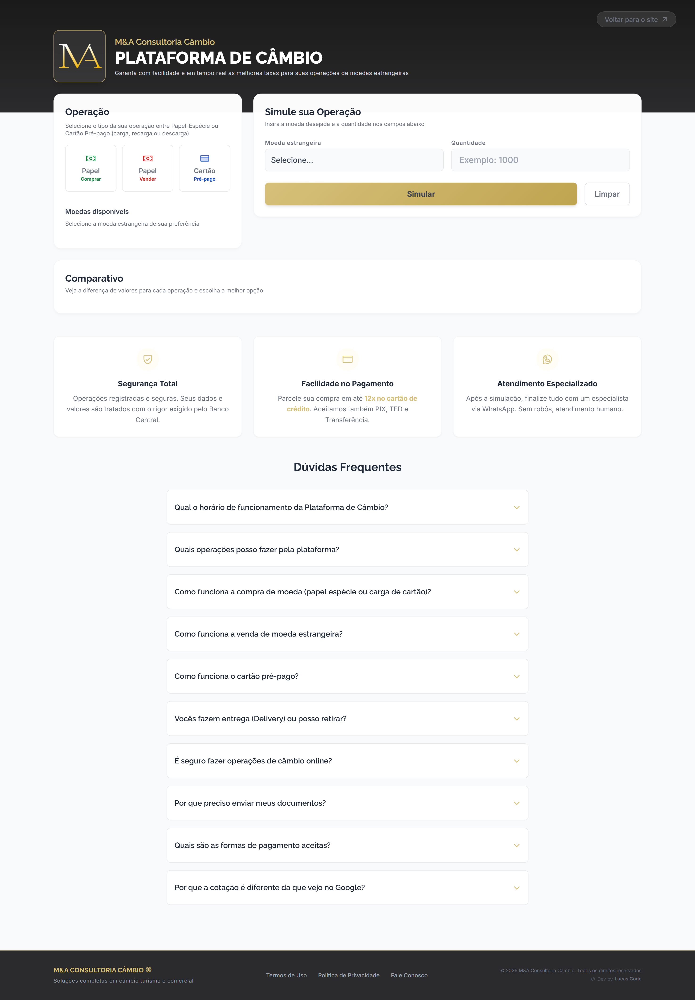

<div align="center">


# Plataforma de Câmbio Online // M&A Consultoria

**Plataforma web para cotação, simulação e solicitação de operações de câmbio turismo**

_Solução desenvolvida para digitalizar e automatizar parte do processo operacional da corretora de câmbio, com integração de dados, regras de negócio, cálculos financeiros e envio automatizado de solicitações_

[]()&nbsp;
[]()&nbsp;
[](./LICENSE)

</div>

<p align="center">
  <a href="#projeto">Sobre</a>&nbsp;&nbsp;&nbsp;|&nbsp;&nbsp;&nbsp;
  <a href="#funcionalidades">Funcionalidades</a>&nbsp;&nbsp;&nbsp;|&nbsp;&nbsp;&nbsp;
  <a href="#arquitetura">Arquitetura</a>&nbsp;&nbsp;&nbsp;|&nbsp;&nbsp;&nbsp;
  <a href="#tecnologias">Tecnologias</a>&nbsp;&nbsp;&nbsp;|&nbsp;&nbsp;&nbsp;
  <a href="#autor">Autor</a>
</p>

<br>

## PROJETO

A **Plataforma de Câmbio Online** foi desenvolvida para a **M&A Consultoria Câmbio**, com o objetivo de levar para o ambiente digital o processo de cotação e solicitação de operações de câmbio turismo.

Na primeira versão, a ferramenta atendia apenas à **compra** de moeda estrangeira. A versão atual cobre as principais operações da consultoria em um único lugar: **compra e venda de papel espécie** e **carga, recarga e descarga de cartão pré-pago**.

A aplicação foi construída do zero para atender às regras e necessidades específicas do negócio, substituindo um fluxo que dependia de consultas e cálculos manuais por uma experiência digital centralizada.

Diferente de um conversor de moedas convencional, a plataforma considera regras específicas de cada operação de câmbio, incluindo **cotação atualizada, IOF, VET, valores mínimos por moeda, cédulas aceitas, regras de delivery, disponibilidade de atendimento e validações de dados.**

A aplicação funciona em uma arquitetura **client-side, sem frameworks JavaScript**, utilizando APIs externas como fonte de dados e serviços de apoio.

<h4>Principais objetivos:</h4>

- Automatizar o processo de cotação e simulação de compra, venda e cartão pré-pago;
- Reduzir cálculos manuais;
- Centralizar as informações necessárias para cada operação;
- Aplicar regras específicas do negócio diretamente na aplicação;
- Simplificar a experiência do cliente;
- Encaminhar cada solicitação já organizada para a equipe, por e-mail e WhatsApp.

🌐 [Acesse a plataforma](https://cotacaoonline.maconsultoriacambio.com.br/)

<p align="center">
  
</p>

## FUNCIONALIDADES

### 🧭 Operações disponíveis

O cliente escolhe a operação no card **Operação**:

| Operação              | O que é                                       | Como é finalizada                                 |
| --------------------- | --------------------------------------------- | ------------------------------------------------- |
| **Papel — Comprar**   | Compra de moeda estrangeira em espécie        | Cadastro na plataforma + e-mails + WhatsApp       |
| **Papel — Vender**    | Venda das cédulas do cliente para a M&A       | Cadastro na plataforma + e-mails + WhatsApp       |
| **Cartão — Carga**    | Compra de cartão pré-pago novo com carga      | Cadastro na plataforma + e-mails + WhatsApp       |
| **Cartão — Recarga**  | Recarga de cartão M&A que o cliente já possui | Direto no WhatsApp, sem cadastro                  |
| **Cartão — Descarga** | Venda do saldo integral do cartão M&A         | Nome e CPF na plataforma + WhatsApp, sem cadastro |

Moedas exóticas na compra e moedas sem taxa na venda são tratadas como **sob consulta** e levam o cliente direto ao especialista no WhatsApp.

### 💱 Cotações e simulações

- Consulta dinâmica das taxas de câmbio, atualizadas a partir do Google Sheets;
- Taxas próprias da M&A para compra de papel espécie, venda de papel espécie, cartão pré-pago e descarga de cartão;
- Cálculo automático dos valores da operação;
- Aplicação de IOF e cálculo de VET na compra;
- Exibição do total a pagar (compra) ou do valor a receber (venda e descarga);
- Comparativo entre **Papel × Cartão** na compra e entre **compra × venda** da mesma moeda na venda;
- Atualização automática das taxas em intervalos definidos, com recálculo da simulação na tela.

### 🧠 Regras de negócio

A aplicação implementa regras específicas para controlar o comportamento de cada operação.

**Compra de papel espécie**

- Quantidade em múltiplos das cédulas disponíveis de cada moeda;
- Moedas exóticas com cotação estimada e confirmação pelo especialista.

**Venda de papel espécie**

- Taxas na plataforma para USD, EUR, JPY, GBP, CHF, AUD e CAD; demais moedas sob consulta;
- Valor mínimo por moeda e quantidade em múltiplos da menor cédula aceita (sem moedas metálicas);
- Taxas válidas para cédulas de série atual; cédulas rabiscadas, manchadas ou rasgadas não são aceitas;
- Entrega das cédulas pelo cliente na loja mais próxima do seu CEP;
- Recebimento via PIX, TED (conta de mesma titularidade do CPF) ou espécie na loja.

**Cartão pré-pago**

- Carga (cartão novo) e recarga com valor mínimo por moeda (ex.: USD 50, EUR 40, GBP 30) e valores redondos para o iene;
- Recarga e descarga presumem cliente M&A e são finalizadas direto com o especialista;
- Descarga sempre do **saldo integral** do cartão (não existe descarga parcial), com envio da foto do cartão no WhatsApp para o especialista.

**Delivery**

- Grátis para operações a partir do equivalente a USD 500, calculado pelas taxas da própria modalidade; abaixo disso, taxa fixa;
- Na carga de cartão, delivery disponível somente a partir do dobro do valor mínimo da moeda;
- Na venda não há coleta: as cédulas são levadas à loja.

**Atendimento**

- Validação de horário de atendimento (simulações liberadas 24h, solicitações apenas em horário comercial);
- Identificação de finais de semana;
- Tratamento de feriados nacionais, incluindo feriados com datas móveis;
- Controle de fuso horário (America/Sao_Paulo).

### 📩 Solicitação de operação

Após a simulação, o cliente envia a solicitação diretamente pela plataforma.

- **Compra, venda e carga de cartão:** o formulário de cadastro é enviado pelo **EmailJS** para a equipe da consultoria e uma cópia segue para o cliente. A confirmação só aparece depois que os dois e-mails são aceitos. Em caso de falha, o cliente pode tentar novamente sem gerar solicitação duplicada, ou seguir pelo WhatsApp.
- **Recarga, descarga e operações sob consulta:** o cliente é direcionado ao WhatsApp do especialista com a mensagem da operação já preenchida.

Compra e venda utilizam os mesmos templates do EmailJS. O conteúdo de cada e-mail se adapta à operação por meio de blocos condicionais.

### 🔐 Validação e tratamento de dados

- Validação de CPF (incluindo dígitos verificadores na descarga);
- Validação e formatação de telefone;
- Validação e formatação de CEP;
- Validação dos dados de recebimento na venda (chave PIX ou dados bancários);
- Sanitização de entradas;
- Validações com RegEx;
- Tratamento de estados inválidos;
- Feedback visual durante as etapas do fluxo.

### 📱 Experiência e responsividade

- Interface responsiva;
- Layout adaptado para desktop, tablet e mobile;
- Menu de operações com submenu dedicado ao cartão pré-pago;
- Fluxo simplificado de simulação;
- Feedback visual para diferentes estados da aplicação;
- FAQ integrado ao fluxo, cobrindo compra, venda e cartão pré-pago;
- Interface focada em clareza e redução de fricção.

## ARQUITETURA

A aplicação foi desenvolvida utilizando uma abordagem **client-side / SPA-like**, sem a utilização de frameworks JavaScript.

A estrutura foi pensada para manter a aplicação leve, modular e independente de um backend dedicado para o fluxo principal.

### Fluxo simplificado

```text
Google Sheets
     │
     ▼
Taxas atualizadas (compra, venda, cartão e descarga)
     │
     ▼
JavaScript
     │
     ├── Regras de negócio por operação
     ├── IOF / VET
     ├── Mínimos e cédulas
     ├── Delivery
     ├── Horários e feriados
     └── Validações
     │
     ▼
Simulação
     │
     ▼
Solicitação
     │
     ├── Compra / Venda / Carga ──► EmailJS ──► M&A + Cliente ──► WhatsApp
     │
     └── Recarga / Descarga / Sob consulta ──► WhatsApp do especialista
```

### Fonte de dados

O **Google Sheets** é utilizado como fonte de dados operacional para as taxas de câmbio, lido pela API de visualização (gviz).

| Taxas                             | Posição na planilha |
| --------------------------------- | ------------------- |
| Compra de papel espécie           | Colunas H e I       |
| Cartão pré-pago (carga e recarga) | Colunas J e K       |
| Venda de papel espécie            | H22:I28             |
| Descarga de cartão                | K22:K30             |

A escolha permite que a equipe responsável atualize as cotações sem necessidade de alterar o código da aplicação. Como a leitura usa posições definidas da planilha, qualquer nova linha ou coluna nessas áreas deve ser acompanhada da atualização correspondente no JavaScript.

### Comunicação

O **EmailJS** é utilizado para o envio das solicitações com cadastro (compra, venda e carga de cartão), encaminhando os dados da operação para a equipe e para o cliente.

O **WhatsApp** é o canal de finalização com o especialista. As mensagens são geradas pela própria aplicação com os dados da operação, distribuindo os atendimentos entre os operadores.

### Fail-Safe

Como o sistema depende de dados externos para realizar cálculos financeiros, a aplicação possui mecanismos para evitar que uma operação seja processada com informações inválidas ou desatualizadas.

Entre os controles implementados estão:

- Verificação da disponibilidade da fonte de dados;
- Moedas sem taxa válida na planilha tratadas como sob consulta, sem cálculo;
- Bloqueio do fluxo quando informações críticas não estão disponíveis;
- Confirmação da solicitação somente após o envio dos e-mails, com nova tentativa sem duplicidade;
- Tratamento de erros de comunicação;
- Feedback ao usuário em situações de indisponibilidade.

O objetivo é priorizar a **integridade das informações utilizadas na simulação e na solicitação**, evitando apresentar ao usuário um resultado baseado em dados que não possam ser considerados confiáveis.

### Decisões Técnicas

**Por que JavaScript sem framework?**

O projeto foi desenvolvido sem frameworks JavaScript para manter o controle direto sobre a aplicação, reduzir dependências e atender ao escopo específico do sistema.

A utilização de JavaScript puro também permitiu implementar as regras de negócio diretamente sobre o DOM e manter uma estrutura enxuta.

**Por que Google Sheets?**

O Google Sheets foi utilizado como fonte operacional das cotações porque permite que a equipe da consultoria atualize os valores sem precisar acessar ou modificar o código da aplicação.

Isso cria uma separação simples entre **dados operacionais** e **código da aplicação**.

**Por que uma abordagem client-side?**

Para o escopo atual, uma arquitetura client-side atende às necessidades da aplicação e elimina a necessidade de manter um backend dedicado para o fluxo principal.

A abordagem também permite uma experiência rápida e interativa, com as principais operações acontecendo sem recarregamento da página.

**Por que templates condicionais no EmailJS?**

Compra e venda compartilham os mesmos dois templates de e-mail. O conteúdo de cada um muda conforme a operação, o que mantém a solução dentro do plano disponível do serviço sem perder a clareza das mensagens.

### Estrutura

```text
cambio-online-turismo/
├── assets/
│   └── img/
│       └── ...              → Logos, imagens e recursos visuais
│
├── src/
│   ├── css/
│   │   └── style.css       → Estilos customizados
│   │
│   └── js/
│       └── script.js       → Lógica principal da aplicação
│
├── dist/
│   ├── script.min.js       → Versão minificada do JavaScript (produção)
│   └── style.min.css       → Versão minificada do CSS
│
├── index.html               → Interface principal
├── CNAME                    → Domínio personalizado
├── LICENSE                  → Licença do projeto
└── README.md
```

## TECNOLOGIAS

| Tecnologia            | Utilização                                   |
| --------------------- | -------------------------------------------- |
| **HTML5**             | Estrutura semântica da aplicação             |
| **Tailwind CSS**      | Estilização e construção da interface        |
| **JavaScript ES6+**   | Lógica da aplicação, DOM e regras de negócio |
| **Google Sheets API** | Fonte de dados para as cotações              |
| **EmailJS**           | Envio das solicitações por e-mail            |
| **WhatsApp**          | Finalização das operações com o especialista |
| **Phosphor Icons**    | Ícones da interface                          |
| **Git / GitHub**      | Versionamento e gerenciamento do projeto     |

---

## LICENÇA

Este projeto possui uma **licença personalizada**.
O código está disponível publicamente para fins de consulta e portfólio, porém sua reprodução, redistribuição, modificação ou utilização comercial não é permitida sem autorização expressa de **Lucas Code** e **M&A Consultoria Câmbio**.

Consulte o arquivo [LICENSE](./LICENSE) para mais informações.

## AUTOR

**`</>` ᴅᴇᴠᴇʟᴏᴘᴇᴅ ʙʏ**

**ʟᴜᴄᴀꜱ ᴄᴏᴅᴇ // ᴡᴇʙ ᴅᴇᴠᴇʟᴏᴘᴍᴇɴᴛ ꜱᴛᴜᴅɪᴏ**  
[**ᴡᴇʙꜱɪᴛᴇ**](https://lvcascode.com.br) ▪ [**ɪɴꜱᴛᴀɢʀᴀᴍ**](https://instagram.com/lvcascode) ▪ [**ʟɪɴᴋᴇᴅɪɴ**](https://linkedin.com/in/lucascouto-dev)
